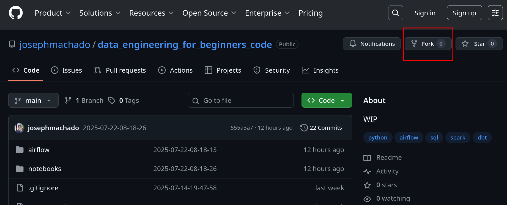
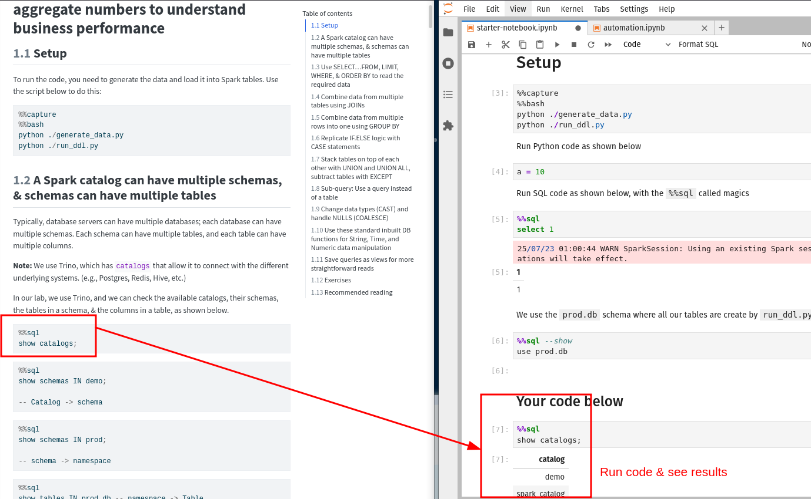

* [Data Engineering for Beginners](#data-engineering-for-beginners)
    * [Setup](#setup)
        * [Prerequisites](#prerequisites)
        * [Starting and stopping containers](#starting-and-stopping-containers)
        * [Running code via Jupyter Notebooks](#running-code-via-jupyter-notebooks)
        * [Airflow & dbt](#airflow--dbt)

# Data Engineering for Beginners

Code for the [Data Engineering for Beginners e-book](https://de101.startdataengineering.com/).

## Setup

The code for SQL, Python, and data model sections are written using Spark SQL. To run the code, you will need the prerequisites listed below.

### Prerequisites

1. [git version >= 2.37.1](https://github.com/git-guides/install-git)
2. [Docker version >= 20.10.17](https://docs.docker.com/engine/install/) and [Docker compose v2 version >= v2.10.2](https://docs.docker.com/compose/#compose-v2-and-the-new-docker-compose-command).

**Windows users**: please setup WSL and a local Ubuntu Virtual machine following **[the instructions here](https://ubuntu.com/tutorials/install-ubuntu-on-wsl2-on-windows-10#1-overview)**. Install the above prerequisites on your ubuntu terminal; if you have trouble installing docker, follow **[the steps here](https://www.digitalocean.com/community/tutorials/how-to-install-and-use-docker-on-ubuntu-22-04#step-1-installing-docker)** (only Step 1 is necessary). Please install the **make** command with `sudo apt install make -y` (if it's not already present). 

### Starting and stopping containers

Fork this repository **[data_engineering_for_beginners_code](https://github.com/josephmachado/data_engineering_for_beginners_code/tree/main?tab=readme-ov-file#setup)**.                                                                      

After forking, clone the repo to your local machine and start the containers as shown below:

```bash
git clone https://github.com/your-user-name/data_engineering_for_beginners_code.git
cd data_engineering_for_beginners_code
docker compose up -d # to start the docker containers
sleep 30 
```

### Running code via Jupyter Notebooks

Open the Starter Jupyter Notebook at [http://localhost:8888/lab/tree/notebooks/starter-notebook.ipynb](http://localhost:8888/lab/tree/notebooks/starter-notebook.ipynb) and try out the commands in ther [Data Engineering for Beginners e-book](https://www.startdataengineering.com/) as shown below.



If you are creating a new notebook, make sure to select the `Python 3 (ipykernel)` Notebook.

When you are done, stop docker containers with the below command:

```bash
docker compose down 
```

### Airflow & dbt

For the Airflow, dbt & capstone section, go into the `airflow` directory and run the make commands as shown below.

**Note** All the code in the dbt, Airflow and capstone chapters are to be run via the terminal at `data_engineering_for_beginners_code/airflow` directory.

```bash
docker compose down # Make sure to stop Spark/Jupyternotebook containers before turning on Airflow's 
cd airflow
make restart # This will ask for your password to create some folders
```

You can open Airflow UI at [http://localhost:8080](http://localhost:8080) and log in with `airflow` as username and password. In the Airflow UI, you can run the dag.

After the dag is run, in the terminal, run `make dbt-docs` for dbt to serve the docs, which is viewable by going to [http://localhost:8081](http://localhost:8081).

You can stop the containers & return to the parent directory as shown below:

```bash
make down
cd ..
```
